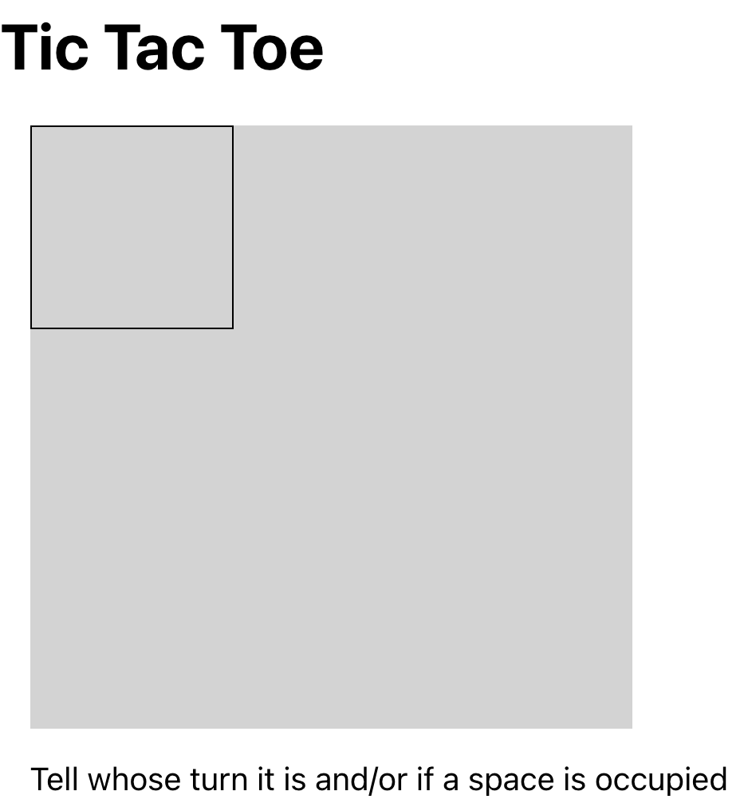
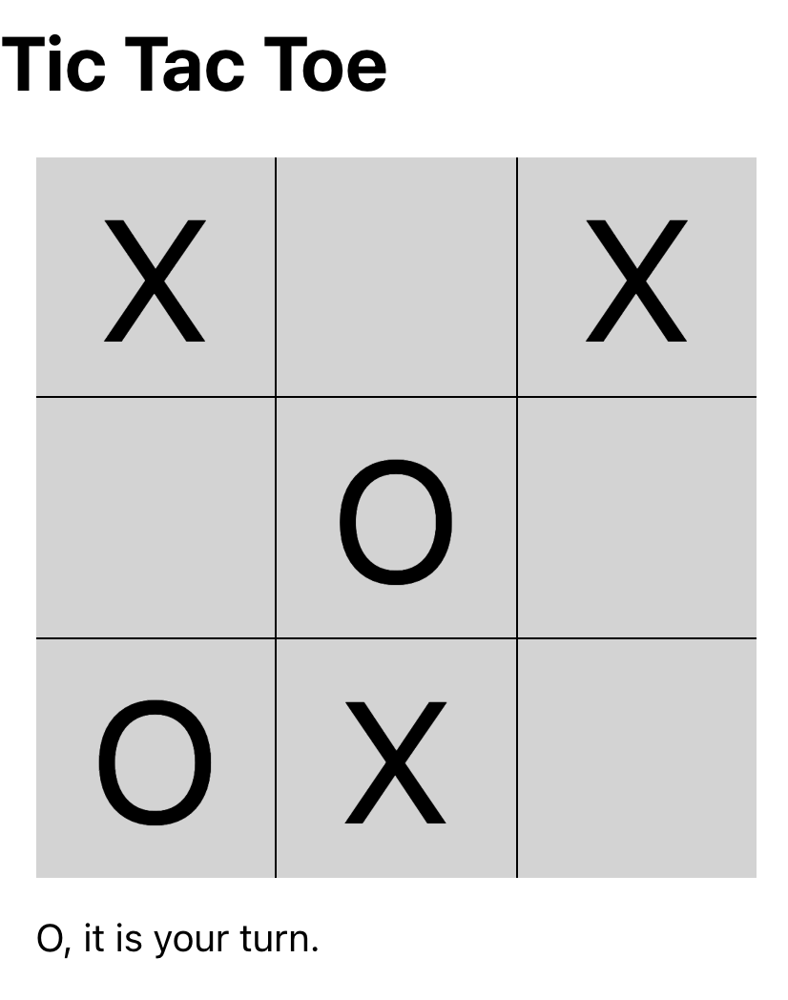

Begin by running `npm install`

Then, when you run `npm start` you will see this empty table with two buttons:

Edit `src/App.js` so you can place Xs and Os.  Among other things, you'll need to

1. Populate the board with a 3x3 grid of `Cell`s.
2. Add `useState` hooks for the board contents and the current player turn.
3. Add click handlers to the cells that place Xs and Os

As you do this:

1. Only allow placement in empty squares.
2. Update the message below the board to show whose turn it is and also indicate errors.

You are not required to detect a win; but, feel free if you like the challenge.

You can use as much or as little of the provided code as you like. In other words, you can add, change, or 
remove functions, variables, parameters, or anything else you don't like.  You can even start from scratch 
if you prefer.

You may use any _static_ online resource you like. You may not post to sites like Stack Overflow and ask 
for help.

